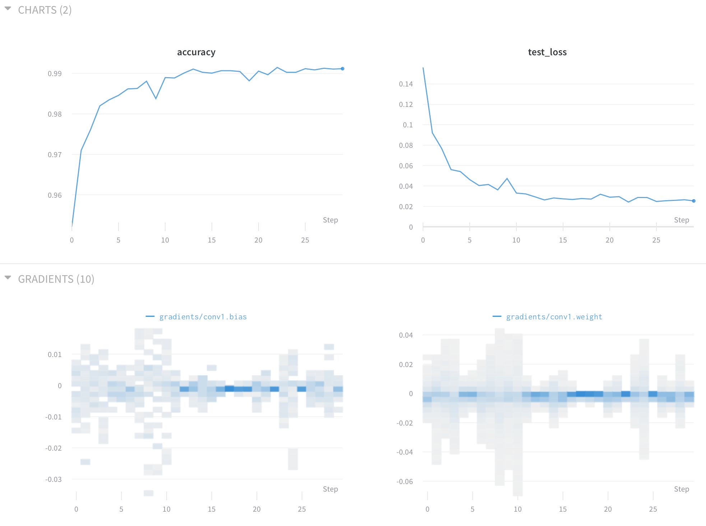

# TL;DR

I’m using graph convolutional models to predict protein structure and interactions between different proteins. I use visualizations of gradients to track the heartbeat of my models, make architectural adjustments, and diagnose problems during training.

# About me

I am a rising fifth-year PhD student in Polly Fordyce’s lab in the Department of Genetics at Stanford University. Prior to starting grad school, I completed my undergraduate degree in Biology at the University of Utah. I spent most of my undergraduate career engaged in research projects using the small nematode worm [*C. elegans*](https://en.wikipedia.org/wiki/Caenorhabditis_elegans) and statistical models to understand the interplay between an organism’s genetic makeup and its environment. The statistical models I used were the gateway to becoming interested in more powerful machine learning techniques that I now use every day in my graduate research.

Upon starting at Stanford, I was determined to take advantage of the excellent machine learning curriculum, despite a relatively limited background in computer science and math. I’ll be the first to admit, getting up to speed with the math behind some of these methods is quite tricky for someone with training primarily in biology and chemistry. However, there is no better way to learn than by implementing these models from scratch, just like we did in Stanford’s excellent [CS 231n](https://www.youtube.com/playlist?list=PL3FW7Lu3i5JvHM8ljYj-zLfQRF3EO8sYv) and [CS 229](https://www.youtube.com/watch?v=UzxYlbK2c7E&list=PLA89DCFA6ADACE599) courses.

Now that I had the background understanding of biology and the skills to design and implement deep learning architectures, I just needed a problem to focus my energy. I found exactly that problem when working to better define and predict molecular interactions.

# My research

My graduate research specifically focuses on the biophysics of molecular interactions, which is a fancy way of saying that I predict how tightly proteins stick together in living organisms. Processes governed by the interactions between two or more biological molecules are responsible for an amazing array of different functions. These interactions are:

- what your cells use to determine which genes to turn on when,
- how your immune system recognizes whether a substance in your blood is you or a foreign invader,
- and increasingly the basis of cutting-edge medical treatments. 

To understand how deep learning can apply to comprehending, and ultimately designing, these interactions, we first have to understand a bit more about how proteins are constructed.

   
  
An example of an important intermolecular interaction: an antibody in complex with a short protein sequence from the human rhinovirus (PDB ID: 1A3R)

## Proteins: nature's toolbox

Proteins are composed of long chains of amino acids, small chemical compounds also referred to as “residues”, strung together like beads on a string. Only 20 of these amino acids comprise the set from which proteins can be constructed. However, despite such a limited alphabet, nature has been able to devise proteins that perform a dizzying array of functions, from binding and regulating other proteins to synthesizing chemicals critical to sustain life.

Proteins accomplish these myriad tasks through differences in their three dimensional structure. The structure, in turn, is ultimately defined by the chemical properties of the amino acids themselves and the order in which they are strung together. For instance, the core of most proteins is usually where we find the hydrophobic (“water-hating”) amino acid residues, while the protein's surface is more likely to have more hydrophilic (“water-loving”) residues. In a world made of water, it's generally best for the water-hating amino acids to hide on the inside of the protein. These chemical properties help define the protein’s structure, which determines its function by positioning key functional residues. The functional residues might reside on the protein's surface, as with many binding proteins, or in its core, as with many enzymes -- proteins that catalyze chemical reactions.

## Connecting protein sequence to 3D structure

Now that we know a bit about protein sequence and its connection to protein function by way of structure, it sure seems like it would be nice if we had a model to connect the sequence of a protein’s amino acids to its fully-folded 3D structure. Unfortunately, this is an incredibly challenging task that remains one of the [largest open problems](https://en.wikipedia.org/wiki/Levinthal%27s_paradox) in computational biology. Despite recent progress by [DeepMind](https://deepmind.com/blog/article/alphafold) and [others](https://www.biorxiv.org/content/10.1101/265231v1), we remain a long way from a generalizable model to perfectly predict a protein’s structure from its sequence alone.

Although the protein folding problem is far from solved, there are many proxy measures of structure that can still provide useful insights into potential function. Contact maps are one of the most widely used methods to abstract away the important components of a folded protein without having to predict the full structure. Contact maps are simply 2D binary matrices where each row and column represent one amino acid in the protein. If a contact of a certain type (for example a covalent bond or a hydrogen bond) exists between two residues, the value at that point in the matrix is one, otherwise it is zero. Since these contacts are undirected, contact maps are symmetric about the main diagonal. Contact maps can be significantly easier to predict that complete 3D structures because of the correlation between contacts in local regions and the projection of the problem from three dimensions into two. These maps still retain information relevant to protein function such as the position of potential binding pockets and local structure. Consequently, I have decided to predict multi-channel contact maps from the protein’s sequence alone, with the hope that these contact maps will serve as a useful intermediate when dissecting the strength and mechanism of protein-protein interactions.

   
  
An example of a contact map. On the left is the contact map predicted by a deep learning model. The ground truth map is shown on the right.

# My process

One of the most interesting and frustrating parts of my research is having the freedom to play around with novel deep learning architectures. I find it endlessly rewarding to read a paper, implement the paper’s new method in PyTorch, and see the results (good or bad) for the prediction task I’m trying to solve. However, not all new methods are right for my problems, and even the ones that can help significantly often don’t work perfectly on the first try.

## Recognizing promising directions

The toughest part of my job is resisting the temptation to be a glutton for novelty. Shiny object syndrome is real and in a world like academia, where deadlines can be much more of a suggestion than a requirement, it can lead to months spent chasing a new method that offers no improvement for your prediction task. As a result, I’ve learned to be very careful when deciding whether to pursue any new method. I try my best to allow the data structures, and the biological processes that generate them, to help guide my decision whether to change direction or hold the course. Before I implement a single new line of code, I like to ask myself:

- Does the method fit the process that generates the data? - e.g. Binding curves have underlying biochemical intuition that can reduce the number of parameters that need to be fit.
- Does the data structure match the ideal type for a given architecture? - e.g. 2D CNNs for image data/RNNs for sequences.
- Are there logistical challenges associated with using a specific method on my target dataset? - e.g. Can I fit the entire model into GPU memory when working with protein structure data?

In the case of predicting contact maps for protein-protein interactions, graph convolutional networks (GCNs) meet all three of these requirements. The atoms that make up proteins are connected by sets of bonds and each atom is not bonded to a uniform number of partners. Therefore, a graph better approximates the natural data structure of proteins than a 2D or 3D CNN would. GCNs also offer a significant performance gain over 2D CNNs for the specific problem of contact map prediction. Whereas 2D CNNs would, in effect, be predicting the same value twice in the case of symmetric contact maps, graph convolutions can be designed to predict each contact only once, leading to dramatic improvements in memory efficiency. 

## Overcoming obstacles

GCNs represent a relatively new and rapidly evolving area of study in deep learning. As a result the processes of implementing and using these architectures can be a fair bit harder than for established tasks like using a CNN on image data. I’ve run into a number of interesting and puzzling failure modes, including constant prediction of the mean value, overflow of parameter values producing NaNs, and even complete failure to train. Each failure mode has required its own unique debugging process, but there’s one technique I’ve found to be indispensable across all failure types: visualizing patterns within a model’s gradients. 

## Why gradients?

Why might you want to visualize the distribution of the gradients within your model? The answer might not be immediately obvious, given that you are already tracking your target metrics like loss or accuracy. But what do you turn to if you see no improvement in these standard measures of performance? Here I’d like to remind you of the update rule that your optimizer is using every step it takes:

<!-- $$\theta := \theta - \alpha \nabla J(\theta)$$ -->

Where *Θ* is your parameter, *α* is your learning rate, and *J* is the loss function for the current batch or example. Now it may be a bit more obvious why we are interested in tracking gradients as our model trains: the only two values affecting your parameter updates are your learning rate and your gradient. Since the learning rate is usually fixed (though this isn’t always the case for all optimizers), the gradients generally dictate the direction and magnitude of a given update.

### Gradients vs. parameters

Since the gradients are being used to update the parameters, you might ask, “why not just look at the parameters of the model directly?” The answer is that gradients are information rich and they have the same interpretation no matter where you are in the training process. The gradient will always tell you the direction and “steepness” at your current location in the optimization landscape. If you are near a local optimum, gradients will be generally be smaller than if you are far from a local optimum. Moreover, methods like regularization exist to directly control the scale of the parameters, but the scale of the gradients is far harder to directly control as the experimenter.

### Gradient trends

Over time, you should expect all of the gradients to trend toward zero as your model’s parameters approach a set of (locally) optimum values. If you notice the variance of your distribution of gradients trending upward as your model trains, you may want to take steps such as lowering the learning rate or introducing regularization to ensure you do not overstep the optimum.

As you approach an optimum value for your model’s parameters, you should see the histogram of gradients shrink toward zero at the same time that you see your loss and/or accuracy begin to plateau. If the gradients are shrinking and the accuracy/loss is not where you would expect, that may be an indication that you’ve reached a local optimum and might be trapped. In this case, increasing the learning rate or relaxing regularization constraints might be helpful.

   

### Gradient scale

One final pattern that is often worth examining is the scale of the gradients themselves. Because the gradient is the derivative of the loss function with respect to the parameter, parameters for which a small change would drastically change the loss of an example would be expected to have a large derivative relative to that of an unimportant parameter. Paying attention to the relative scale of different layers of module of your network can tell you a lot about which components might be critical for accurate prediction versus those playing only a minor or supporting role. If you notice a difference of an order of magnitude or more between the gradients flowing to different parts of your model, that may be an indication that a certain module may not be critical, and in some cases may be actively detrimental to network performance.

I was recently able to use this trick to identify that one of my models was effectively failing to update an embedding layer. Instead, it was simply adapting the network that sat on top of the embeddings to adjust to their random initialization. By focusing more time on creating an informative embedding layer before adding the network on top of it, I’ll likely be able to achieve better results than trying to simultaneously train the network and the embeddings.

In the example below, you’ll have the chance to play around with a network that contains an unnecessary module that injects random noise. You’ll be able to see for yourself the effect of unimportant components on network performance during training.

   

## Visualizing gradients

Weights & Biases offers a great, easy to use tool to directly track and visualize histograms of your gradients as your model trains. By just including `wand.watch(model, log='all')` before your training loop, you’ll be able to have W&B display histograms of both your model’s parameters and their gradients at each update step. Hopefully, you’ll be able to use some of the tricks I discussed here to shortcut debugging of your next model! 

# An example

Since most people don’t work on problems related to protein folding, I've implemented the following Google Colab Notebook for you to play around with gradient visualizations yourself using a model trained on the small and manageable MNIST dataset. Go ahead and check out the notebook [here](notebooks/explore_gradients.ipynb). Try adjusting the learning rate, batch size, momentum, etc. to get a feel for the effect on the spread and magnitude of the gradients for each model.

